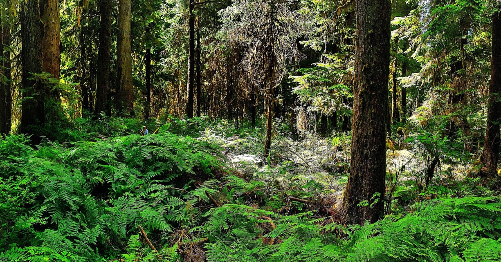

I'm a Plant Biology Ph.D student at Washington State University in Pullman, WA. I started here in the fall of 2020. My doctoral research will be on intraspecific variation in the responses of trees to current and future drought conditions. I am particularly interested in genetic diversity from differing biogeographic histories in the Cascade Mountain Range, and how this diversity produces variation in functional trait responses to drought. I hope that through this work I can inform individual-level tree demography models, as well as more targeted forest management practices. 

